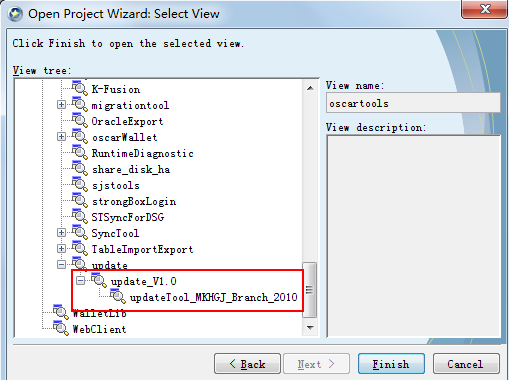
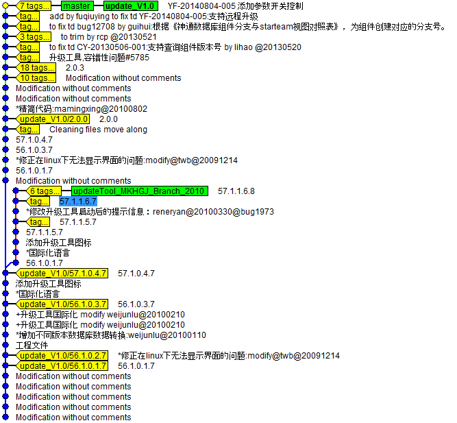
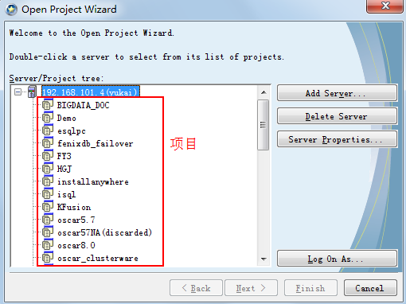

# st2git 

该工程是在 [git-starteam](https://github.com/planestraveler/git-starteam) 的基础上进行的修改。

st2git 用于将 starteam 上面的项目转换为 git 项目。

> 使用该程序之前需要在本机安装git。

> 使用该程序之前需要在本机安装starteam客户端。

## 基本思路

- 导入模式

project 指定项目名称，view 指定视图名称。

程序到starteam服务器查询指定视图，递归获取到该视图包括其所有子视图。

转换成git项目后，为主视图创建一条分支，分支名即为视图名；若子视图是从父视图衍生出的，则为子视图创建一条分支，分支名即视图名；若子视图与父视图没有衍生关系，该视图被忽略。

如果没有子视图，只创建主视图一条分支。

以 update_V1.0 为例：



转换结束后，生成的 git graph:



- 导入算法

starteam 项目转换为 git 项目，采用 "label by label" 的思路。

统计从一个 label 到下一个 label 之间的所有的revision，形成 commit。相等的 revision 视为同一 commit。满足以下条件，两个 revision 视为相等：

1. revision 被同一用户创建

2. revision 拥有相同的注释或其中一个 revision 注释为空

3. 两个 revision 是连续的

比如：

```
file1.c: user1  3:50pm  Message 1
file2.c: user1  3:51pm  <empty log message>
file3.c: user2  3:52pm  <empty log message>
file4.c: user1  3:53pm  <empty log message>
```

file1.c 和 file2.c 将被纳入同一个 git commit，file3.c 将被纳入一个git commit， file4.c 将被纳入一个git commit
itself. 

## 用法

1. 安装jar包

```
mvn install:install-file -Dfile=<path-to-file> -DgroupId=<group-id> -DartifactId=<artifact-id> -Dversion=<version> -Dpackaging=<packaging>
```

安装 lib文件夹下的jar包到mvn仓库。

2. 打包

```
mvn package
```

生成的可执行文件位于 target/output 目录下。

3. 修改配置文件 config.properties

```sh
// starteam 服务地址
host=192.168.101.4 
port=49201
// 邮箱域名，创建git commit时使用
email=db.org

// 以上三项使用默认项即可

// 项目名称，见图1
project=oscartools
// 视图名称，即进入项目后的任意视图
view=update_V1.0
// starteam 用户名密码
user=duhuaiyu
password=1984114
// 生成的 git 项目位置
workfolder=D:\\st-git\\repo\\test
// git.exe 的位置
gitexe=D:\\tools\\Git\\bin
// 转换过程中需要排除的文件
excludeFiles=.obsolete,.obsolote,.user,.old,UpdateList_Frontend.xls
// 转换过程中需要排除的文件夹
excludeFolders=.git,Debug,Release,test,JDBCTestPrj,release
// 转换完毕是否进行验证
verify=true
// 需要跳过的视图
skipViewsPattern=
// 需要跳过的 label
excludedLabels=xxx;xxx;xxx
```



4. 启动转换程序

由于 starteam SDK 需要 32位的jre，故在需要指定32位jre的路径。

```
jre\bin\java.exe -jar st2git.jar
```

st-git.log 是转换过程中生成的日志，其中 `Skiped View` 下输出的内容即被忽略或跳过的视图名。